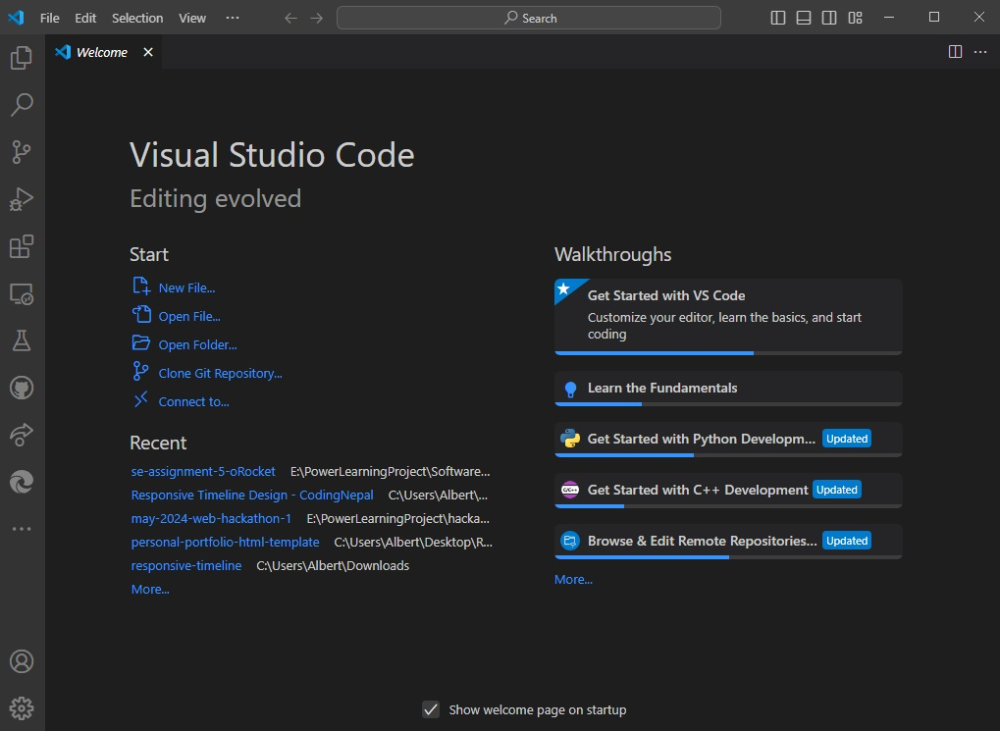
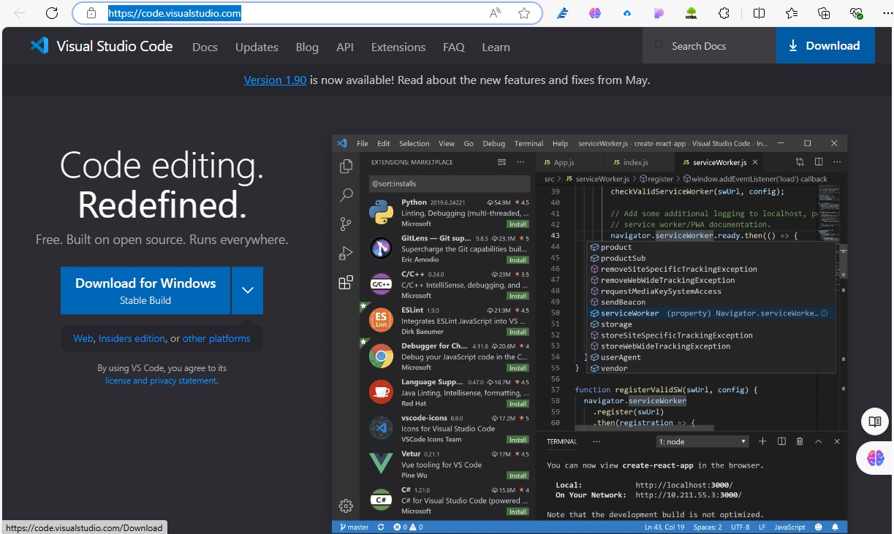
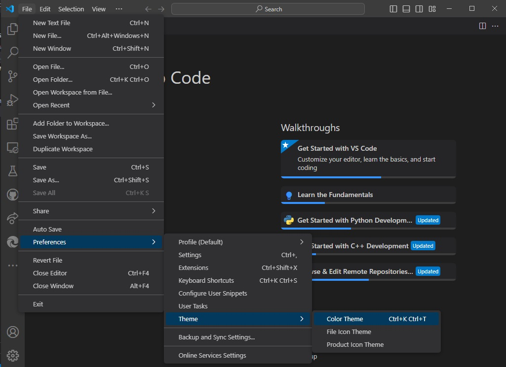
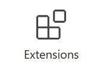
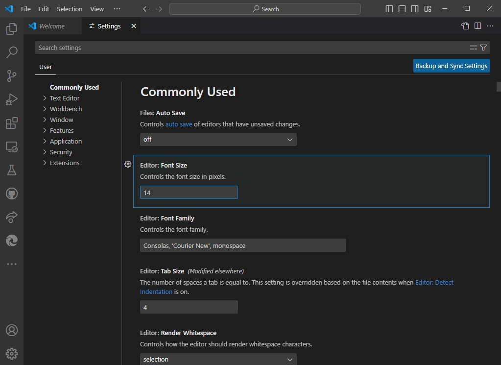
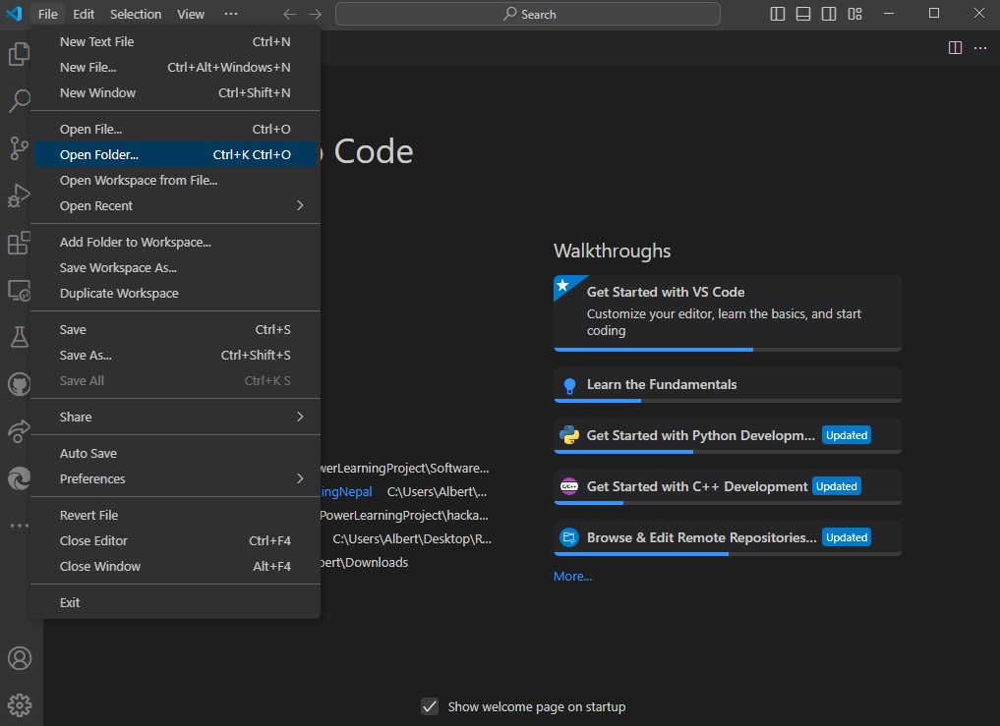
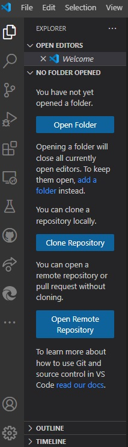
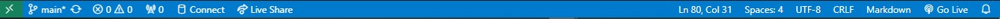
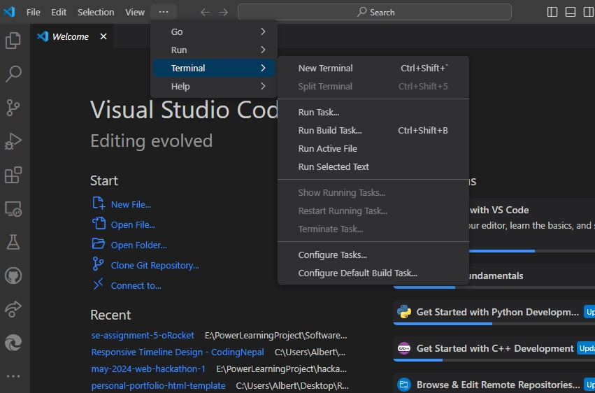
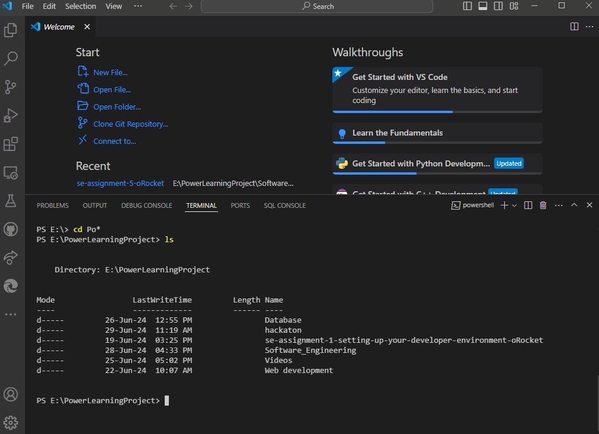

# Installation of VS Code


## Steps to download and install Visual Studio Code on Windows 11

**Download the Installer**:
- Visit the Visual Studio Code website:
    ```
    https://code.visualstudio.com/
    ```
    
- Click on the "Download" button to download the installer.

**Run the Installer:**
- Locate the downloaded file (usually in the Downloads folder) and double-click it to run the installer.

**Install VS Code:**
- Accept the license agreement.
- Choose the installation location or leave it as default.
- Select additional tasks (optional), such as:
    - Create a desktop icon.
    - Add "Open with Code" action to Windows Explorer file context menu.
    - Add "Open with Code" action to Windows Explorer directory context menu.
    - Register Code as an editor for supported file types.
    - Add to PATH (useful for running code from the command line).
- Click "Install" and wait for the installation to complete.

**Launch VS Code:**
- Once the installation is complete, click "Finish" to launch VS Code.

## Setup
*Initial configurations and settings for an optimal coding environment:*

**Theme:**
- Open the Command Palette (Ctrl+Shift+P).
- Type "Preferences: Color Theme" and select a theme that suits your preference (e.g., Dark+, Light+).
- 

**Extensions:**
- Click on the Extensions icon in the Activity Bar or press `Ctrl+Shift+X`.
- 
- Install essential extensions such as:
    - Prettier - Code formatter
    - ESLint
    - Live Server
    - Python
    - 
    - IntelliCode

**Settings:**
- Go to File > Preferences > Settings or press Ctrl+,.
- Configure settings such as font size, line numbers, auto-save, etc.
- For example, to change the font size, search for "Font Size" and adjust it.
- 

**Workspace Setup:**
- Open a folder for your project by going to File > Open Folder.
- Create a workspace by saving the workspace file for later use.
- 

## User Interface Overview:
*Main components of the VS Code user interface:*

**Activity Bar:**
- Located on the far left of the window.
- Contains icons for different views such as Explorer, Search, Source Control, Run and Debug, Extensions.
- Purpose: Quick access to main features and extensions.
- 

**Side Bar:**
- Located next to the Activity Bar.
- Displays different views depending on the selected Activity Bar icon.
- For example, the Explorer view shows the file and folder structure of the opened project.
- 

**Status Bar:**
- Located at the bottom of the window.
- Shows information about the current file, such as encoding, line endings, language mode, Git branch, and errors/warnings.
- Purpose: Provide contextual information and quick actions.
- 

## Integrated Terminal
*How to open and use the integrated terminal:*

- Open the integrated terminal by:
    - Going to View > Terminal.
    - Using the shortcut Ctrl+ (backtick).

- Advantages:
    - Access terminal without leaving the editor.
    - Run commands, scripts, and manage version control within the same window.
    - Supports multiple terminal instances.




## File and Folder Management:
*Creating, opening, and managing files and folders:*

- Create a new file: `Right-click in the Explorer view > New File or press Ctrl+N`.
- Create a new folder: `Right-click in the Explorer view > New Folder`.
- Open a file: `Double-click on the file in the Explorer view or use Ctrl+P to quickly find and open files`.

- Efficient navigation:
    - Use `Ctrl+P` to open the Quick Open panel.
    - Use `breadcrumbs` (enabled by default) at the top of the editor to navigate through file paths.
    - Use `Ctrl+Tab` to switch between open files.

## Command Palette:
*What is the Command Palette and how to access it:*

- The Command Palette is a powerful tool in VS Code that allows you to access and run commands quickly.
- Access it by pressing Ctrl+Shift+P or F1.
- Common tasks performed using the Command Palette:
    - Open settings: `"Preferences: Open Settings (UI)".
    - Install extensions: `"Extensions: Install Extensions"`.
    - Change theme: `"Preferences: Color Theme"`.
    - Open a new terminal: `"Terminal: Create New Integrated Terminal"`.

## Extensions in VS Code:
*Role of extensions and how to manage them:*

- Extensions enhance the functionality of VS Code by adding features like code linting, formatting, snippets, debuggers, etc.
- To find and install extensions:
    - Click on the Extensions icon in the Activity Bar or press Ctrl+Shift+X.
    - Search for the desired extension and click "Install".

- To manage extensions:
    - Click on the gear icon next to the installed extension in the Extensions view.
    - Options include disabling, uninstalling, or configuring settings for the extension.

**Essential extensions for web development:**
- Live Server
- Prettier - Code formatter
- ESLint
- JavaScript (ES6) code snippets
- HTML CSS Support

## Settings and Preferences:
*Customizing settings in VS Code:*
- Open settings: File > Preferences > Settings or press Ctrl+,.
- Change theme:
    - Open the Command Palette (Ctrl+Shift+P).
    - Type "Preferences: Color Theme" and select a theme.
- Change font size:
    - In the Settings view, search for "Font Size" and adjust it.
- Customize keybindings:
    - Go to File > Preferences > Keyboard Shortcuts or press Ctrl+K Ctrl+S.
    - Search for the command and set a new keybinding.

## Debugging in VS Code:
*Setting up and starting debugging:*
- Open the file to debug:
    - Write a simple program (e.g., a Python script).

- Set breakpoints:
    - Click in the gutter next to the line number where you want to set a breakpoint.

- Open the Run and Debug view:
    - Click on the Run and Debug icon in the Activity Bar or press Ctrl+Shift+D.

- Configure launch.json:
    - Click on "create a launch.json file" link.
    - Select the appropriate environment (e.g., Python).

- Start debugging:
    - Click the green play button in the Run and Debug view.
    - Use debugging features such as step over, step into, step out, and watch variables.

- Key debugging features:
    - Breakpoints
    - Step through code
    - Variable inspection
    - Call stack view
    - Watch expressions

## Using Source Control:
*Integrating Git with VS Code:*

- Initialize a repository:
    - Open the project folder in VS Code.
    - Open the integrated terminal and run git init to initialize a Git repository.

- Stage and commit changes:
    - Open the Source Control view by clicking the Source Control icon in the Activity Bar.
    - Stage changes by clicking the "+" icon next to the file.
    - Enter a commit message in the input box and click the checkmark to commit.

- Push changes to GitHub:
    - Set up the remote repository by running git remote add origin <repository-url> in the terminal.
    - Push changes by running git push -u origin master.

- Using VS Code Git Integration:
    - Stage, commit, and push changes directly from the Source Control view.
    - View and resolve merge conflicts.
    - Manage branches and view commit history.